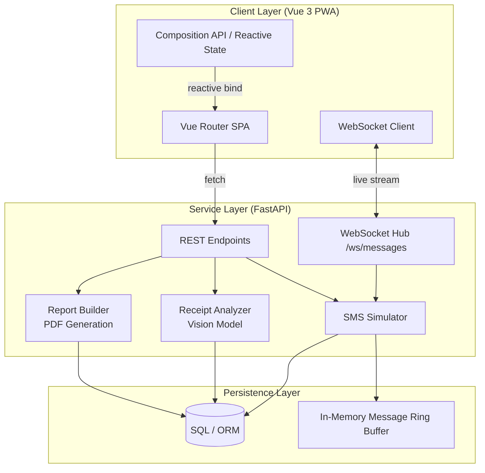

<div align="center">

# FinPilot

**Scalable Financial Intelligence Platform**

[](LICENSE)
[](https://python.org)
[](https://fastapi.tiangolo.com)
[](https://vuejs.org)
[](https://vitejs.dev)
[](https://web.dev/progressive-web-apps)

Real-time transaction intelligence — SMS parsing, receipt OCR, spend analytics, and live dashboard — built as a decoupled Vue 3 SPA + FastAPI service in 24 hours.

**1st Place — Pentathon 3.0 · Appathon Stream · SRMIST · March 2026**

</div>

---

## Table of Contents

- [Architecture](#architecture)
- [Feature Surface](#feature-surface)
- [Tech Stack](#tech-stack)
- [Project Structure](#project-structure)
- [API Reference](#api-reference)
- [Getting Started](#getting-started)
- [Demo Scenarios](#demo-scenarios)
- [Team](#team)

---

## Architecture

The system is split into three independently deployable layers: a PWA client, a FastAPI service, and a persistence layer. Real-time updates flow over WebSocket; all other communication is REST.



**Data flow summary:**
1. The Vue SPA boots as a PWA, connects to `/ws/messages`, and receives a full history snapshot followed by live deltas.
2. The SMS Simulator generates tagged transactions at a configurable interval, persists them, and broadcasts each event to all connected WebSocket clients.
3. Receipt images are uploaded via `POST /receipts/analyze`; the Receipt Analyzer calls a vision model, extracts line-items with unit-cost breakdowns, and returns structured JSON.
4. The Report Builder materialises a monthly spend PDF from a transaction payload on demand.

---

## Feature Surface

| Feature | Detail |
|---|---|
| Live SMS Feed | WebSocket stream with rolling 40-message client buffer and full history replay on reconnect |
| Receipt Intelligence | Vision-model OCR — extracts merchant, date, line items, category, quantity, and per-unit cost with price-increase detection |
| Monthly Spend Report | On-demand PDF export with transaction categorisation and bucket aggregation |
| Simulation Engine | Configurable-interval SMS generator with three switchable demographic scenarios |
| Recurring Seed | One-click injection of recurring-transaction patterns for subscription analysis |
| Demo Control UI | Self-contained HTML console served at `/` — no frontend build required for backend testing |
| OpenAPI Docs | Full Swagger UI at `/docs`; machine-readable schema at `/openapi.json` |
| PWA | Installable, offline-capable via `vite-plugin-pwa` |

---

## Tech Stack

### Frontend

| Layer | Technology |
|---|---|
| Framework | Vue 3 · Composition API |
| Routing | Vue Router 5 |
| Build | Vite 7 |
| Styling | TailwindCSS 3 |
| PWA | vite-plugin-pwa |
| Runtime target | Node ≥ 20.19 / ≥ 22.12 |

### Backend

| Layer | Technology |
|---|---|
| Framework | FastAPI (async, lifespan-managed) |
| Validation | Pydantic v2 |
| Vision / OCR | Pluggable vision model via `ReceiptAnalyzer` |
| PDF generation | `ReportBuilder` (custom) |
| Real-time | WebSocket (`starlette`) |
| Persistence | SQLAlchemy ORM / SQL |

---

## Project Structure

```
FinPilot/
├── app/                        # FastAPI service
│   ├── main.py                 # Application entry, routers, control UI
│   ├── services/
│   │   ├── simulator.py        # SMS generation engine
│   │   ├── receipt_vision.py   # Vision-model receipt OCR
│   │   └── report_builder.py   # Monthly PDF report builder
│   └── requirements.txt
├── src/                        # Vue 3 SPA
│   ├── main.js
│   ├── App.vue
│   ├── router/
│   ├── views/
│   ├── composables/
│   └── utils/
├── public/
├── index.html
├── vite.config.js
├── tailwind.config.js
└── package.json
```

---

## API Reference

### Health

| Method | Path | Description |
|---|---|---|
| `GET` | `/health` | Liveness probe → `{"status": "ok"}` |

### Messages

| Method | Path | Description |
|---|---|---|
| `GET` | `/messages` | Full message history (JSON array) |
| `WS` | `/ws/messages` | Live stream — initial `history` packet then per-event `message` packets |

**WebSocket packet schema:**
```json
// Initial snapshot
{ "type": "history", "messages": [ ...MessageItem ] }

// Live event
{ "type": "message", "data": { "timestamp": "...", "message": "...", "bucket": "..." } }
```

### Simulation

| Method | Path | Body | Description |
|---|---|---|---|
| `GET` | `/simulation/status` | — | Running state + interval |
| `POST` | `/simulation/control` | `{"state": "start" \| "stop"}` | Start or stop the generator |
| `POST` | `/simulation/seed-recurring` | — | Inject recurring demo transactions |
| `GET` | `/simulation/scenarios` | — | List all scenarios + active ID |
| `POST` | `/simulation/scenarios/activate` | `{"scenarioId": "..."}` | Switch active scenario |

### Receipts

| Method | Path | Body | Description |
|---|---|---|---|
| `GET` | `/receipts/status` | — | Vision model configuration status |
| `POST` | `/receipts/analyze` | `multipart/form-data` (image) | Extract line items and insights |

**Receipt response shape:**
```json
{
  "merchant": "...",
  "bill_date": "YYYY-MM-DD",
  "currency": "INR",
  "items": [
    {
      "name": "...",
      "category": "...",
      "quantity": 2,
      "total_price": 120.00,
      "cost_per_item": 60.00,
      "cost_per_unit": 30.00,
      "unit_label": "per 500g"
    }
  ],
  "insights": {
    "price_increases": [...],
    "better_value_items": [...],
    "lowest_unit_cost_items": [...]
  }
}
```

### Reports

| Method | Path | Body | Description |
|---|---|---|---|
| `POST` | `/reports/monthly` | `MonthlySpendReportRequest` | Generate monthly spend PDF |

---

## Getting Started

### Prerequisites

- Python 3.11+
- Node.js 20.19+ or 22.12+
- A `.env` file in the project root (vision model API key — see `.env.example` if provided)

### Backend

```bash
cd app
pip install -r requirements.txt
uvicorn app.main:app --reload --port 8000
```

The backend control UI is available at `http://localhost:8000`.  
Swagger docs at `http://localhost:8000/docs`.

### Frontend

```bash
npm install
npm run dev        # dev server with HMR
npm run build      # production build
npm run preview    # preview production build
```

The Vue SPA starts at `http://localhost:5173` by default.

---

## Demo Scenarios

Three transaction profiles can be activated via `POST /simulation/scenarios/activate` or the control UI:

| ID | Name | Purpose |
|---|---|---|
| `balanced` | Balanced Household | General spending mix — groceries, utilities, lifestyle |
| `inflation` | Inflation Pressure | Elevated essentials spend to stress anomaly and trend detection |
| `subscription-heavy` | Subscription Heavy | Dense recurring digital services for subscription pattern analysis |

---

## Team

| Name | Role |
|---|---|
| [Sarvesh Raam T K](https://github.com/sarvesh-raam) | Lead Architect |
| [Jeswin Sunsi](https://github.com/JeswinSunsi) | Frontend & Integration |
| [Abinav Mugundhan](https://github.com/abinavmugundhan) | Backend & Services |

Recognised by Mrs. Lakshmi Kothandapani (Manager — IT, Flextronics) and Mr. Dhilip Kumar R (Technologist, Tata Steel) at Pentathon 3.0, SRMIST.

---

## License

MIT © 2026 FinPilot Team
